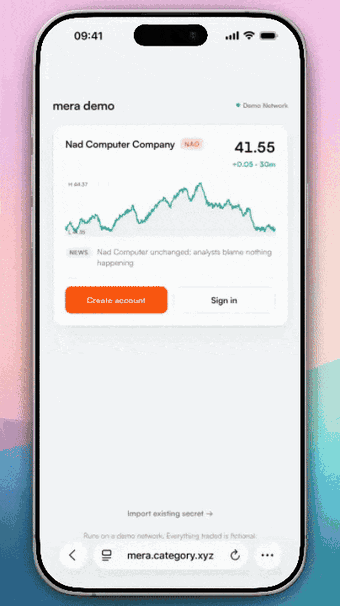

# mera

Accounts on any chain and platform, from a passkey.

mera is a TypeScript library for creating accounts from a passkey. It derives 32 secret bytes from the passkey to serve as the root for each account and enables signing sessions. Account derivation, recovery, storage, and product flows such as funding remain under application control.

Developers can use mera to:

- create new accounts from a passkey without requiring a smart-account contract or custody service;
- provide users with an account that is instantly backed up and recoverable on any device with a passkey;
- secure an existing recovery phrase, private key, or other data with a passkey;

## Supported platforms

- Web browsers
- Chrome extensions
- React Native on iOS 18 or later and Android 9 or later

Native applications can reuse passkeys created with mera by using the platform's WebAuthn APIs.

See [authenticator support](https://mera.category.xyz/authenticator-support/) for browser and OS support.

## Documentation and demos

Installation instructions, guides, compatibility details, the security model, API reference, and live demos are available on the [mera documentation website](https://mera.category.xyz/). The [passkey PRF model](https://mera.category.xyz/prf-demo/) demonstrates how a passkey determines account data.

## Repository

- [`library/`](./library/) contains the published package and its tests.
- [`demos/`](./demos/) includes web, Chrome extension, and mobile demos, as well as a model illustrating how a passkey determines account data.
- [`docs/`](./docs/) contains the documentation website.

## Status

mera is currently in preview, and the API may change before version 1.0. Category Labs has completed an internal security review. The documentation outlines its [security model](https://mera.category.xyz/concepts/security-model/).

## Contributing

Issues and pull requests are welcome. See the [contribution guide](./CONTRIBUTING.md) and [code of conduct](./CODE_OF_CONDUCT.md).

mera is developed by [Category Labs](https://github.com/category-labs).

## License

Licensed under either the [Apache License 2.0](./LICENSE-APACHE) or the [MIT License](./LICENSE-MIT), at the licensee's option.