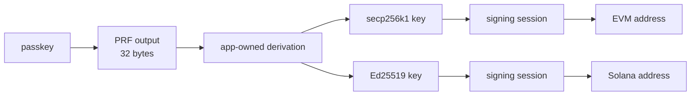
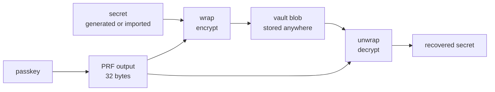

# A passkey is enough: ordinary private keys, no smart accounts

> Working draft — foundation for a blog post introducing mera.
>
> **Writing rules. Remove after draft:**
>
> - Simple, clear language.
> - Wordiness is a smell: don't take twenty-five words to say what five can.
> - Say “account”, not “wallet”. “Wallet” only for wallet apps (MetaMask, Phantom, the demo).
> - No marketing tone.
> - No punchline-style sentences like “It’s not about X. It’s about Y.”
> - No forced drama, hype, or motivational language.
> - No corporate phrases like “unlock,” “leverage,” “game-changer,” “seamless,” “robust,” or “delve.”
> - Avoid overusing short one-line paragraphs.
> - Avoid generic introductions like “In today’s fast-paced world.”
> - Prefer concrete examples over abstract claims.
> - Don’t assume user behavior (paper backups, screenshots, drop-off): state what the scheme requires, not how people allegedly handle it.
> - Don’t present the typical stack as the required one: state what a design requires, then what is merely common on top (ERC-4337, bundlers, paymasters are options, not requirements).
> - Named wallet apps (MetaMask, Phantom) are examples, not an exhaustive list — phrase so others clearly exist.
> - Prefer calm, thoughtful writing over persuasive copywriting.
> - The writing should feel like a smart person explaining something clearly, not like a content marketer.
>
> **Scope decisions, made while outlining:**
>
> - Audience: crypto/wallet developers. ERC-4337, EOAs, bundlers need no introduction; WebAuthn internals do.
> - The library is an experimental reference implementation: no network-support claims (“EVM and Solana today”). The entropy is chain-agnostic — any KDF, any chain. Chains appear only as examples.
> - Keep the library/app boundary honest: mera produces entropy and signing sessions; derivation belongs to the app. Don’t credit mera with what the demo does.
> - Wrapped mode stays conceptual — what it enables, not how it’s implemented.
> - Derived and wrapped are parallel options with different trade-offs; don’t frame one as fixing a constraint of the other.
> - Every technical claim should be checkable against the README, the slides, or the code.
> - Don’t reference sections by number (“as section 2 showed”); name the thing in place — headings will move.
> - The post is about the idea, not the repository: no code-location or housekeeping sections.
> - Link the first body mention of each spec’d name to the same URL as its References entry; later mentions stay plain.

mera is a TypeScript library that turns a passkey into a full-fledged signing keypair — an ordinary account on any chain. It does so without smart accounts or third-party trust assumptions. mera is powered by the [WebAuthn PRF extension](https://www.w3.org/TR/webauthn-3/#prf-extension), part of the standard behind passkeys, which ships today in almost all authenticators.

## The current state of crypto onboarding

Self-custody onboarding (where no one but the user can move the funds) has not changed much in a decade. The app generates a recovery phrase — a [BIP-39](https://github.com/bitcoin/bips/blob/master/bip-0039.mediawiki) mnemonic of twelve or twenty-four words — and asks the user to write it down. The scheme works in every wallet app, but its costs land before the app has done anything useful. The first is the flow itself: no ordinary app asks a new user to transcribe those words and re-enter some of them before first use. The second outlasts onboarding. The user is now responsible for backing up a secret that controls all future funds.

Hosted logins remove the phrase. The user signs in with Google or another login provider; the key is held by a service or split across an MPC network (several servers that jointly sign, none holding the whole key) that signs against a valid login token. Onboarding becomes a login form, but a third party now sits in every signature. The key works only while the service exists and the account is in good standing, and with no standard export path, moving the account elsewhere is the vendor's decision, not the user's.

## Every wallet app is a key store first

Developers face a version of this too. Whatever a wallet app is actually for — payments, trading, a game — it rests on a layer that has nothing to do with the product: generate keys, store them, gate their use, lock them when idle, recover them when a device is lost. All of it has to work before the first feature ships. None of it sets the app apart, and getting it wrong costs user funds.

Storage is the clearest example, and it is different on every platform. iOS has the Keychain and the Secure Enclave, Android has the Keystore, and the browser has nothing: localStorage and IndexedDB are readable by any script that runs on the page. Even the mobile secure hardware handles crypto's curves (the different families of key used for signing) unevenly. The Secure Enclave signs [P-256](https://csrc.nist.gov/pubs/sp/800/186/final) only, the Keystore's curve support depends on the Android version and the device, and neither signs [secp256k1](https://www.secg.org/sec2-v2.pdf), so the chain key sits wrapped at rest and hot in app memory while signing. A team shipping web, iOS, and Android designs storage three times and onboarding three times, for the same account.

Passkeys looked like the answer on both fronts. A passkey is a keypair in the device's secure hardware, gated by a biometric and synced by the platform, and it ships with every phone, laptop, and browser. For the user that means no phrase and no password; for the developer it means generation, storage, locking, and cross-device sync are the platform's job. Crypto adopted passkeys through smart accounts, where the passkey signs and a contract on the chain verifies. But the approach has structural costs.

## Why a passkey can't sign a transaction

The problem is down in the details of [WebAuthn](https://www.w3.org/TR/webauthn-3/), so a short primer. Each passkey lives on an authenticator — a phone, a laptop, or a security key — and is scoped to one site. The private key is never exposed to the site; the server sees only the public key. Every use runs a ceremony: the relying party (the site the passkey belongs to) sends a one-time challenge, the browser passes it to the authenticator, and the authenticator signs after a biometric or PIN check — WebAuthn calls this user verification.

The important detail is what gets signed. The authenticator does not accept arbitrary payloads; it signs a fixed structure:

```
signature = sign(authenticatorData ‖ SHA-256(clientDataJSON))
```

[`authenticatorData`](https://www.w3.org/TR/webauthn-3/#sctn-authenticator-data) is the device's statement: a hash of the site's ID, a signature counter, flags such as whether the user was verified. [`clientDataJSON`](https://www.w3.org/TR/webauthn-3/#dictionary-client-data) is the browser's statement: the challenge, the origin, the operation type. For a sign-in on `account.example.com`:

```
authenticatorData
  rpIdHash    32 bytes   SHA-256("account.example.com")
  flags        1 byte    user present, user verified, backup state
  signCount    4 bytes   uint32

clientDataJSON
  {
    "type": "webauthn.get",
    "challenge": "<what the app sent, base64url>",
    "origin": "https://account.example.com"
  }
```

This envelope is where WebAuthn's phishing resistance comes from: the browser, not the page, fills in the origin. It is also why an assertion is not a signature over an arbitrary 32-byte hash. The app's only input is the challenge: it can put `keccak256(rlp(tx))` there, but what comes back is a signature over the whole envelope, which no EVM node will accept. The curve is wrong too. Authenticators sign with P-256 in practice, while Ethereum expects secp256k1 and Solana [Ed25519](https://www.rfc-editor.org/rfc/rfc8032).

The established workaround: teach the chain to verify the envelope. On EVM chains that means a smart account per user that stores the passkey's public key, and a P-256 verifier (a contract, or the [RIP-7212](https://github.com/ethereum/RIPs/blob/master/RIPS/rip-7212.md) precompile where the chain provides one natively). A contract cannot start a transaction on its own, so something must submit it: a bundler, the relayer service defined by the smart-account standard [ERC-4337](https://eips.ethereum.org/EIPS/eip-4337) — with a paymaster if the app sponsors gas — or an executor account the app runs itself. Solana repeats the whole thing separately — its own P-256 precompile, a smart-account program such as LazorKit (or a third-party key service like Para or Privy), and a different address scheme — with nothing reused from the EVM side.

Each account is a contract, so creating one costs a deployment. The address comes from the account contract and its factory; [CREATE2](https://eips.ethereum.org/EIPS/eip-1014) (which derives a contract's address from its code and a chosen salt, regardless of deployment order) can reproduce it on another chain, but only where the provider's contracts are deployed, so the user's address depends on the provider being present on every chain they use. Switching providers means migrating on-chain, because the verification logic is the provider's contract. The developer pays too: the team has to learn the account implementation's ins and outs, run or rent its infrastructure, and carry that provider as a third-party dependency on every chain the app supports.

## The WebAuthn PRF extension

The PRF extension changes what an application can get out of a ceremony. Alongside the signature, the authenticator exposes a per-credential pseudo-random function (PRF) — feed it an input, get back fixed, unguessable bytes:

```
PRF(secret, salt) → 32 bytes
```

The secret is minted at passkey creation (FIDO2 calls it CredRandom) and never leaves the authenticator. Each evaluation is one [HMAC-SHA-256](https://www.rfc-editor.org/rfc/rfc2104) keyed by that secret, computed inside the authenticator behind the same biometric check as the signature. The application passes a salt (an input it chooses) and gets 32 bytes back; it never sees the secret. (This is FIDO2's [`hmac-secret`](https://fidoalliance.org/specs/fido-v2.2-ps-20250714/fido-client-to-authenticator-protocol-v2.2-ps-20250714.html#sctn-hmac-secret-extension) extension; WebAuthn PRF is the browser-facing wrapper.)

Three properties make the output usable as key material:

- **Deterministic.** The secret is created once and reused: the same passkey and salt return the same 32 bytes, forever, on every device the passkey syncs to.
- **Site-scoped.** The secret belongs to the credential, and the credential to one relying party, so a phishing site gets different bytes from a different credential. The browser also hashes a fixed prefix into the salt (`SHA-256("WebAuthn PRF" ‖ 0x00 ‖ salt)`), so a page can never evaluate the underlying hmac-secret PRF at arbitrary points — WebAuthn's evaluations stay separate from the platform's own uses of it.
- **Full entropy.** HMAC-SHA-256 output is 32 uniformly distributed bytes (full-strength randomness), directly usable as a seed or a private key.

This moves where WebAuthn meets the chain. Instead of teaching each chain to verify WebAuthn envelopes, an application takes biometric-gated entropy out of the ceremony and derives ordinary keys from it — whatever key derivation function (KDF) and curve the target chain needs. The chain sees a normal signature from a normal account; everything WebAuthn-specific stays on the client.

PRF ships today in the authenticators bundled with major operating systems and browsers: iCloud Keychain, Google Password Manager, and Windows Password Manager, plus 1Password, with support landing between 2024 and 2026. Security keys needed no new hardware: YubiKeys have supported the underlying hmac-secret since firmware 5.2.3 in 2019, and browsers began exposing it as PRF in 2023, starting with Chrome.

## How mera uses it

mera packages this into a few primitives: passkey ceremonies that return PRF output, signing sessions for secp256k1 and Ed25519, address helpers, and an encrypted vault format. The library produces stable, authenticator-bound entropy and signs with keys the application hands it; how entropy becomes keys (the KDF, the paths, the account model) belongs to the application. A session keeps key bytes in memory and zeroes them on `session.lock()`. One ceremony per session is enough: one biometric check, then any number of signatures.

There are two ways to use the PRF output: derive the account's keys from it, or use it to encrypt a secret that exists independently of it.

### Derived mode

In derived mode the account is computed entirely from the passkey. mera pins a fixed salt (`createDeterministicPrfSalt()`), so every ceremony with the same passkey returns the same 32 bytes. The application runs those bytes through its derivation scheme of choice; mera's demo wallet app feeds them into BIP-39 and derives keys with [BIP-32](https://github.com/bitcoin/bips/blob/master/bip-0032.mediawiki) for secp256k1 and [SLIP-0010](https://github.com/satoshilabs/slips/blob/master/slip-0010.md) for Ed25519, with further accounts coming from HD paths, the standard hierarchy wallet apps use for multiple accounts. Leaving derivation out of the library is deliberate: these schemes already have stable, audited implementations, and mera does not ship another.



The skeleton — one ceremony, then app-owned derivation:

```ts
import {
  createDeterministicPrfSalt,
  createSecp256k1SigningSession,
  getEvmAddress,
  getPasskeyPrfOutput,
} from "mera"
import { derivePrivateKeyWithYourWalletScheme } from "./wallet-derivation"

const rpId = "account.example.com"

const prfSalt = createDeterministicPrfSalt()
const { prfOutput } = await getPasskeyPrfOutput({ rpId, prfSalt })

const privateKey = derivePrivateKeyWithYourWalletScheme({
  entropy: prfOutput,
  path: "m/44'/60'/0'/0/0",
})

const session = createSecp256k1SigningSession({ consumePrivateKey: privateKey })
const address = getEvmAddress(session.publicKey)
```

Nothing is stored: no database row, no localStorage entry, no blob to sync. Sign in on a new device with the synced passkey, and the same addresses appear. No recovery flow. And because the derivation is standard, the application can offer an explicit export: the entropy maps to an ordinary recovery phrase that imports into any standard wallet app, like MetaMask or Phantom.

### Wrapped mode

In wrapped mode the secret does not come from the passkey: it is generated client-side or imported, and the PRF output derives the key that encrypts it. The result is a small vault blob, useless without a passkey ceremony, that the application can store anywhere: localStorage, a backend, a sync service. mera defines the vault format and the unwrap step; storage and lifecycle belong to the application.



Separating the secret from the passkey makes several things possible:

- **Importing an existing account.** A user migrating from another wallet app keeps their addresses; the imported recovery phrase is encrypted into the vault like any other secret.
- **A passkey as a second factor.** If the blob lives on the application's backend, having the blob is not enough to spend — and neither is access to the user's login. Spending requires the passkey ceremony on top.
- **Rotation.** The secret can be replaced without touching the passkey, and the passkey can be replaced by re-encrypting the vault.

### Quick comparison

|            | Derived                                  | Wrapped                                   |
| ---------- | ---------------------------------------- | ----------------------------------------- |
| Keys       | computed from the passkey                | derived from a separate secret             |
| Storage    | none                                     | a blob, anywhere                          |
| New device | synced passkey is enough                 | passkey plus the blob                     |
| Fits       | log in from anywhere, stateless accounts | migrations, passkey as 2FA                |

The modes compose: an application can onboard new users in derived mode and offer wrapped vaults to those bringing an existing recovery phrase or key.

## What users and developers get

For users:

- **Onboarding is one passkey prompt.** Create a passkey, see an address. Nothing to transcribe, nothing to remember.
- **One passkey, many chains.** The same entropy derives accounts for every chain the app supports.
- **Backup comes for free.** A synced passkey is backed up the way logins already are — by a credential manager like iCloud Keychain or Google Password Manager.
- **A new device is a sign-in.** Same passkey, same addresses.
- **There is a way out.** Where the app offers export, the recovery phrase imports into any standard wallet app, like MetaMask or Phantom.

For developers:

- **The key-store layer mostly disappears.** Derived mode stores nothing; wrapped mode stores a blob that is useless without the passkey; locking is one call.
- **Nothing to deploy or operate.** No contracts, bundlers, paymasters, executor accounts, key servers, or provider dependencies — and in derived mode, no server-side state at all.
- **The dependency is small and boring.** About 2,000 lines including its JSDoc, built from standard, well-studied primitives: WebAuthn, HMAC-SHA-256, [HKDF-SHA-256](https://www.rfc-editor.org/rfc/rfc5869), and [AES-GCM](https://csrc.nist.gov/pubs/sp/800/38/d/final) — with ordinary HD derivation living in the demo, not the library.
- **The primitive is general.** 32 deterministic, authenticator-bound bytes feed any KDF for any curve — and they can key things that are not chains at all, such as client-side encryption of app data.

## References

- **[WebAuthn Level 3](https://www.w3.org/TR/webauthn-3/)** (W3C) — the passkey API. Specifically: [authenticator data (§6.1)](https://www.w3.org/TR/webauthn-3/#sctn-authenticator-data), [client data (§5.8.1)](https://www.w3.org/TR/webauthn-3/#dictionary-client-data), [the PRF extension (§10.1.4)](https://www.w3.org/TR/webauthn-3/#prf-extension).
- **[CTAP 2.2](https://fidoalliance.org/specs/fido-v2.2-ps-20250714/fido-client-to-authenticator-protocol-v2.2-ps-20250714.html)** (FIDO Alliance) — the authenticator protocol underneath WebAuthn. Specifically: [the hmac-secret extension (§12.7)](https://fidoalliance.org/specs/fido-v2.2-ps-20250714/fido-client-to-authenticator-protocol-v2.2-ps-20250714.html#sctn-hmac-secret-extension), where CredRandom is defined.
- **[BIP-39](https://github.com/bitcoin/bips/blob/master/bip-0039.mediawiki)** — mnemonic phrases from entropy.
- **[BIP-32](https://github.com/bitcoin/bips/blob/master/bip-0032.mediawiki)** — hierarchical deterministic derivation for secp256k1.
- **[SLIP-0010](https://github.com/satoshilabs/slips/blob/master/slip-0010.md)** — hierarchical deterministic derivation for Ed25519.
- **[ERC-4337](https://eips.ethereum.org/EIPS/eip-4337)** — account abstraction.
- **[RIP-7212](https://github.com/ethereum/RIPs/blob/master/RIPS/rip-7212.md)** — the P-256 signature-verification precompile.
- **[EIP-1014](https://eips.ethereum.org/EIPS/eip-1014)** — CREATE2, deterministic contract addresses.
- **[RFC 2104](https://www.rfc-editor.org/rfc/rfc2104)** — HMAC.
- **[RFC 5869](https://www.rfc-editor.org/rfc/rfc5869)** — HKDF.
- **[NIST SP 800-38D](https://csrc.nist.gov/pubs/sp/800/38/d/final)** — AES-GCM.
- **[RFC 8032](https://www.rfc-editor.org/rfc/rfc8032)** — Ed25519 (EdDSA).
- **[SEC 2](https://www.secg.org/sec2-v2.pdf)** — the secp256k1 curve.
- **[NIST SP 800-186](https://csrc.nist.gov/pubs/sp/800/186/final)** — the P-256 curve.
