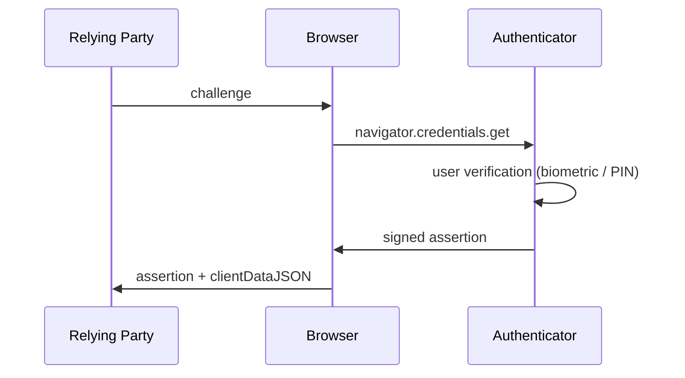
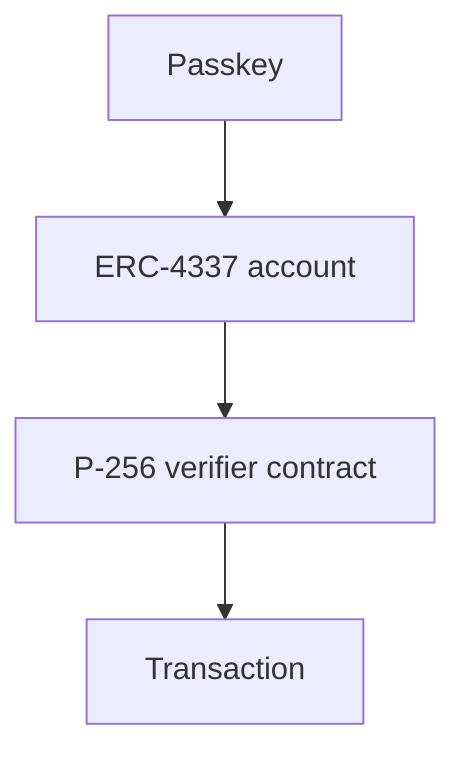
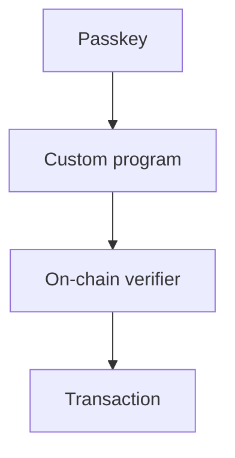
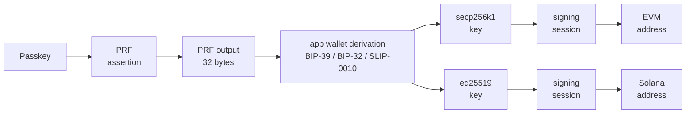

<div class="title-page">

<h1 class="title-main">mera</h1>

<div class="title-tagline">passkey-backed signing<br/>for <em>multichain</em> accounts</div>

<div class="title-sub">one biometric · many chains</div>

</div>

<div class="footer-mark">an introduction</div>

<!--
A 5-10 minute tour: what passkeys are, why combining them with crypto used to be painful,
what the WebAuthn PRF extension changed, and what mera builds on top.
-->

---
layout: default
---

# What is a passkey?

A modern replacement for passwords, built on **WebAuthn**.

<div class="prose">

- A **per-site keypair** lives on your **authenticator** — your phone, laptop, or security key.
- The private key **never leaves** the authenticator. The server only ever sees the public key.
- To use it, you pass a biometric or PIN check — WebAuthn calls this **user verification**.
- **Phishing-resistant by construction**: the browser binds every signature to the **relying party** (the site the passkey belongs to). A passkey for `acme.com` will not sign for `acme-login.com`.
- No shared secret, no password to leak, no SMS code to intercept.

</div>

---
layout: default
---

# The passkey ceremony

A **ceremony** is one end-to-end WebAuthn flow. The relying party sends a one-time **challenge**; the authenticator signs it after a biometric or PIN check — and *the authenticator decides what gets signed*, not you.



---
layout: default
---

# Passkeys + crypto, the old way <span class="num">— I</span>

## The envelope problem

A WebAuthn signature is over a fixed structure:

<div class="formula">

`signature = sign(authenticatorData ‖ SHA256(clientDataJSON))`

</div>

<div class="defns">

- <code>authenticatorData</code> — what the *device* says about this signing: the site's ID hash, a signature counter, and flags (user verified? user present?).
- <code>clientDataJSON</code> — what the *browser* says about the request: the challenge, the origin (`https://acme.com`), and the operation type.

</div>

<div class="prose-tight mt-3">

It is **not** a signature over an arbitrary 32-byte hash. So a passkey cannot be dropped into a place that expects a plain ECDSA signature over `keccak256(rlp(tx))` — the verifier on chain has no idea what this envelope is.

</div>

---
layout: default
---

# Passkeys + crypto, the old way <span class="num">— II</span>

## The smart-account workaround

Teach the chain to verify the WebAuthn envelope — separately for each chain you support.

<div grid="~ cols-2 gap-6" class="mt-3">

<div class="panel">

<div class="panel-head">EVM path</div>



- Smart account per user
- On-chain P-256 verifier
- Bundler & paymaster

</div>

<div class="panel">

<div class="panel-head">Solana path</div>



- Bespoke program per app
- Different address scheme
- No reuse with the EVM side

</div>

</div>

---
layout: default
---

# The WebAuthn PRF extension

A small but significant addition. The authenticator exposes a per-credential **pseudo-random function** — a tiny black box only it can compute.

<div class="formula formula-sm">

`PRF(secret, salt) → 32 bytes`

</div>

<div class="prose-tight">

The *secret* sits inside the authenticator — one per passkey, never extractable. The *salt* is the 32-byte input *the app* passes in.

</div>

<div class="callout">

This is the primitive Mera builds on. 32 bytes of authenticator-bound, biometric-gated, deterministic entropy.

</div>

---
layout: default
---

# Under the hood — the authenticator's secret

We called PRF a black box only the authenticator can compute. Here's what's inside.

<div class="prose">

- When a passkey is created, the authenticator mints a **second secret** alongside the login keypair — a random key the FIDO2 spec calls **CredRandom**. It lives inside the authenticator and is **never extractable**.
- Each PRF call is **one HMAC**, keyed by that secret, computed *inside* the authenticator behind the usual biometric or PIN check.

</div>

<div class="formula">

`PRF output = HMAC-SHA-256( authenticator secret , salt )`

</div>

<div class="prose-tight mt-2">

The app sends a 32-byte salt and gets 32 bytes back — it never sees the secret. This is FIDO2's `hmac-secret` extension; WebAuthn's PRF is the browser-facing wrapper over it. The secret is minted *once* and reused, so the same passkey and salt always return the same bytes.

</div>

---
layout: default
---

# Scoped & deterministic — by construction

Three properties turn those 32 bytes into usable key material.

<div class="prose">

- **Deterministic** — same passkey + same salt → the same 32 bytes, forever. Mera pins one fixed salt via `createDeterministicPrfSalt()`, so a synced passkey reproduces them on any device.
- **Site-scoped** — the output is bound to the site the passkey belongs to, and the browser folds in a fixed prefix *before* the authenticator sees the salt. A phishing site gets **completely different** bytes.
- **Full-entropy** — HMAC-SHA-256 returns 32 uniformly random bytes, so the output is usable directly as a private key.

</div>

<div class="formula formula-sm">

`salt seen by authenticator = SHA-256("WebAuthn PRF" ‖ 0x00 ‖ the salt)`

</div>

---
layout: default
---

# Where the security comes from

<div grid="~ cols-2 gap-10" class="mt-4">

<div class="panel">

<div class="panel-head">What it rests on</div>

- The secret **never leaves** the authenticator — so security reduces to trusting that hardware: Secure Enclave, TPM, or security key.
- Every call is gated by a biometric or PIN. Mera always requires **user verification**.
- A **synced** passkey carries that secret between your devices, so its provider — Apple, Google — is in the trust boundary too. A **hardware key** never syncs: device-bound, nothing in the cloud.

</div>

<div class="panel">

<div class="panel-head">The honest limits</div>

- The 32 bytes are only as safe as the page that receives them. Once handed to the browser they are a hot key: serve over HTTPS, use a strict CSP, and don't hold them longer than necessary.
- There is **no recovery backdoor**. Lose every copy of the passkey and access is gone — that is the design, not a bug.

</div>

</div>

---
layout: cover
class: text-center
title: The mera idea
---

<div class="thesis">

<div class="thesis-line">PRF gives you <em>32 bytes</em>.</div>

<div class="thesis-line">32 bytes is <em>a private key</em>.</div>

<div class="thesis-line">The rest is <span class="accent-strong">plumbing</span>.</div>

</div>

---
layout: default
---

# Architecture — one PRF, many curves



<div class="prose-tight">

Mera hands the app stable, authenticator-bound entropy. The app decides how to turn that entropy into wallet keys; the demo uses BIP-39/BIP-32 for secp256k1 and SLIP-0010 for Ed25519.

</div>

---
layout: default
---

# Mode 1 — Derived

A *stateless* account. Mera reproduces the same PRF output from the passkey and its fixed deterministic salt. The app derives wallet keys with its chosen scheme; HD paths handle account indexing. **Zero storage.**

```ts {all|1-4|6-9|11-13|15-16|all}
const prfSalt = createDeterministicPrfSalt()

const { prfOutput } = await getPasskeyPrfOutput({
  rpId: "account.example.com",
  prfSalt,
})

const secpPrivateKey    = deriveBip32PrivateKey(prfOutput, "m/44'/60'/0'/0/0")
const ed25519PrivateKey = deriveSlip10Ed25519Seed(prfOutput, "m/44'/501'/0'/0'")

const ethereumSession = createSecp256k1SigningSession({ consumePrivateKey: secpPrivateKey })
const solanaSession   = createEd25519SigningSession({ consumePrivateKey: ed25519PrivateKey })
```

<div class="prose-tight mt-2">

New accounts come from the app's HD paths. New device with the same passkey → same addresses, automatically.

</div>

---
layout: default
---

# Mode 2 — Wrapped

A small **encrypted vault** holds one secret — a recovery phrase or key. The PRF output derives the wrapping key. The blob can live anywhere — `localStorage`, a server, a sync service.

```ts {all|1|3-6|8-11|all}
const secret = new TextEncoder().encode(seedPhrase) // generated or imported

const vault = await createSecretVault({
  credential, // from createPasskeyWithPrfOutput — carries prfSalt + prfOutput
  secret,
})

// later, behind a fresh passkey ceremony:
const bytes   = await unwrapSecretVault({ vault, prfOutput })
const phrase  = new TextDecoder().decode(bytes)
const keys    = deriveAccountFromPhrase(phrase) // app's HD derivation
```

<div class="prose-tight mt-2">

AES-256-GCM with a canonical AAD (*extra bytes that must match on decrypt*): <span class="aad">domain ‖ version</span>. Only a passkey ceremony reproduces the PRF-derived wrapping key, so the blob is inert on its own.

</div>

---
layout: default
---

# Derived vs. wrapped — when to use which

<div grid="~ cols-2 gap-10" class="mt-4">

<div class="panel">

<div class="panel-head">Derived</div>

- Mera returns stable PRF output; the app derives standard wallet keys
- **No storage** of any kind
- New device with the synced passkey → same address, instantly
- New accounts come from standard HD paths
- Best for: account abstraction, deterministic recovery, "log in from anywhere"

</div>

<div class="panel">

<div class="panel-head">Wrapped</div>

- Holds **one secret** (recovery phrase or key), encrypted under a PRF-derived key
- Blob stored anywhere
- Supports **importing** an existing wallet (e.g. migrating users)
- **Reveal or rotate** the secret without changing the passkey
- Best for: hot-wallet UX, server-synced backups, importing an existing secret

</div>

</div>

---
layout: default
---

# User experience

<div grid="~ cols-2 gap-10" class="mt-2">

<div class="panel">

<div class="panel-head">Both modes</div>

- No mandatory seed phrase
- **One biometric per session** — not per transaction
- No on-chain smart-account deploy gas
- The same address travels across chains
- Sessions are lockable: `session.lock()` zeroes the private key in memory
- No bundler, no paymaster, no custom verifier program

</div>

<div class="panel">

<div class="panel-head">Wrapped, specifically</div>

- Vault blob lives next to the app — `localStorage`, a backend, a sync service
- Returning user performs **one** PRF assertion to unwrap
- Then signs **many transactions** in that session, with no further passkey prompts
- Feels like a hot wallet — but the keys at rest are encrypted under a key only the authenticator can produce
- Lose the passkey, lose the vault. No silent extraction.

</div>

</div>
